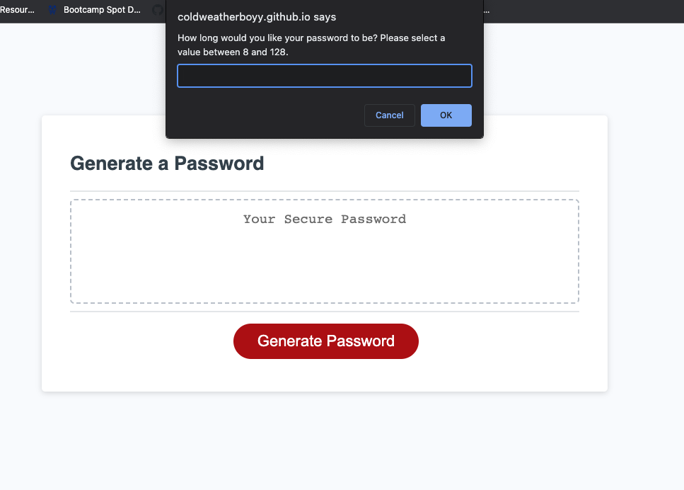

# Password Generator

## Description

This project is a password generator, to be used to generate passwords between the length of 8 and 128 characters, utilizing upper and lower case letters, numbers, and special characters as per the user's choice. As this uses Math.random, which is not cryptographically secure (click [here](https://www.w3schools.com/jsref/jsref_random.asp) for reference), this is meant as an experiment in utilizing JavaScript for user interactivity and was one of my first practical applications of JavaScript.

## Installation

N/A

## Usage

To use this application, please visit [this page](https://coldweatherboyy.github.io/Password-Generator/). Click the Generate Password button and begin answering window prompts and confirms!

## Credits

Coded in [VS Code](https://code.visualstudio.com/).

Thoughts and ideas from [Jake Rudlong](https://github.com/JDR8888). 

Debugging advice from [Antal Spector-Zabusky](https://gitlab.com/antalsz).